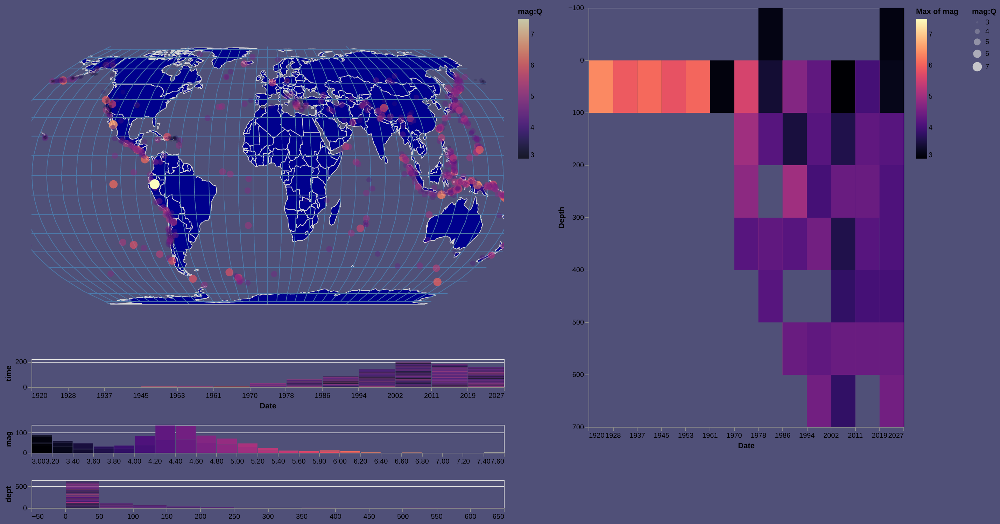
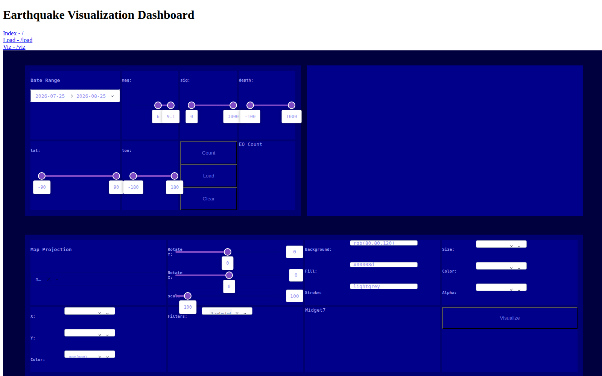

# Earthquake Visualization Dashboard

[](https://github.com/chernobylx/Earthquake-Visualization-Dashboard/actions/workflows/ci.yml)

An interactive dashboard for exploring earthquake data from the
[USGS Earthquake Catalog API](https://earthquake.usgs.gov/fdsnws/event/1/),
built with [Dash](https://dash.plotly.com/) and [Altair](https://altair-viz.github.io/)/Vega-Lite.

Query the live USGS catalog with custom date, magnitude, depth, and location
filters, then explore the results through a linked set of views: a world map
with configurable projection, brushable histogram filters, and a
time–depth heatmap. Selections in any view filter all the others.



## Features

- **Live data loading** — query the USGS FDSN event API with validated request
  parameters (date range, magnitude, significance, depth, latitude/longitude
  bounds), preview the result count before downloading, and browse the raw
  records in a sortable, filterable data table.
- **Cross-filtered views** — the map, histograms, and heatmap share Vega-Lite
  interval selections: brush a histogram or drag on the map and every other
  view updates.
- **Configurable map** — choice of projection (equal Earth, Mercator,
  azimuthal equal-area, ...), rotation and scale sliders, and custom colors.
- **Flexible encodings** — pick which variables drive point size, color, and
  opacity on the map, and which pair of variables the heatmap aggregates.



## Architecture

The code is a small installable package (`src/earthquake_dashboard/`) with
three layers:

| Module | Responsibility |
|---|---|
| `data_loader.py` | `RequestParams` (a validated dataclass mirroring the USGS API's query parameters) and `DataLoader` (count/query/preprocess against the live API, returning a typed GeoDataFrame) |
| `visualizer.py` | `DataVisualizer` validates the input DataFrame's columns and dtypes, then composes the Altair chart: world map + earthquake layer, per-variable histogram selectors, and a heatmap, all linked through shared selections |
| `app.py` + `pages/` | The multi-page Dash app: layout, widgets, and the callbacks that wire user input to `DataLoader` and `DataVisualizer` |

Separating the API client and the chart factory from the Dash layer keeps both
independently testable and reusable — the same `DataVisualizer` powers the
exploratory notebook in `notebooks/`.

## Getting started

### With pixi (recommended)

Install [pixi](https://pixi.sh), then from the repository root:

```bash
pixi install       # create the environment from pixi.toml
pixi run app       # start the dashboard at http://127.0.0.1:8050
```

### With pip

```bash
python -m venv .venv && source .venv/bin/activate   # .venv\Scripts\activate on Windows
pip install -e ".[dev]"
python -m earthquake_dashboard.app
```

Then open <http://127.0.0.1:8050>, go to the **Load** page, choose your query
parameters, click **Load**, and click **Visualize**.

Set `DASH_DEBUG=1` to run the app with Dash's debug tooling enabled.

## Development

```bash
pixi run check     # lint + tests
pixi run lint      # ruff check
pixi run format    # ruff format
pixi run test      # pytest
```

The test suite covers request-parameter validation, the DataFrame contract
enforced by `DataVisualizer`, and (when the USGS API is reachable) live
count/query/preprocess round trips — the live tests skip automatically
offline.

## Project structure

| Path | Purpose |
|---|---|
| `src/earthquake_dashboard/` | Installable package: API client, chart factory, Dash app |
| `src/earthquake_dashboard/pages/` | Dash pages (home, loader/visualizer dashboard) |
| `src/earthquake_dashboard/assets/` | Stylesheet for the dashboard grid layout |
| `tests/` | pytest suite |
| `notebooks/` | Exploratory notebook the dashboard grew out of |
| `docs/figures/` | Images used in this README |
| `pixi.toml` / `pyproject.toml` | Environment, packaging, and tool configuration |

Earthquake data is fetched on demand from the USGS API and is not committed;
anything saved under `data/` is gitignored.
