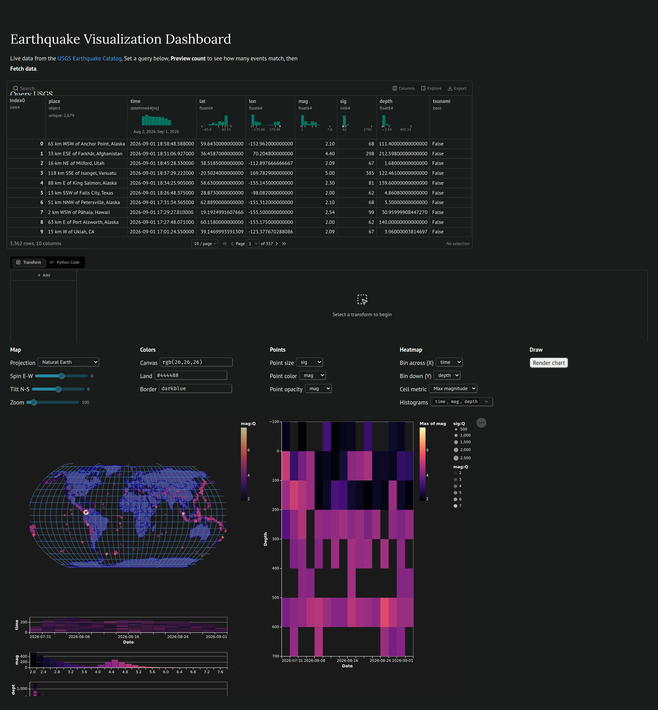

# Earthquake Visualization Dashboard

[](https://github.com/chernobylx/Earthquake-Visualization-Dashboard/actions/workflows/ci.yml)

An interactive dashboard for exploring earthquake data from the
[USGS Earthquake Catalog API](https://earthquake.usgs.gov/fdsnws/event/1/), built with
[Dash](https://dash.plotly.com/) and [Altair](https://altair-viz.github.io/)/Vega-Lite.

Query the live USGS catalog by date, magnitude, significance, depth, and geographic
bounds, then explore what comes back through a linked set of views — a world map, a
stack of brushable histograms, and a time–depth heatmap. Every view shares the same
Vega-Lite selections, so a brush drawn in any one of them filters all the others.

**[Try the live dashboard](https://0be82526-8d32-4767-bbed-2b63946ff944.plotly.app/dashboard)** — hosted on Plotly Cloud, querying the USGS catalog in real time.


## Features

- **Live data loading** — query the USGS FDSN event API through a validated parameter
  object, preview the match count before committing to a download, and browse the raw
  records in a sortable, filterable table.
- **Cross-filtered views** — the map, histograms, and heatmap share interval
  selections. Brush a histogram or drag across the map and every other view responds.
- **Configurable map** — three projections (Natural Earth, azimuthal equal-area,
  Mercator), rotation and scale sliders, and free-text fill, stroke, and background
  colors.
- **Flexible encodings** — choose which variables drive point size, color, and opacity
  on the map, which pair the heatmap aggregates over, and which columns become filter
  histograms.
- **Time axes that follow the window** — the heatmap and time histogram switch between
  yearly, monthly, and daily tick formats based on the span of the loaded data, so a
  one-month query doesn't render every tick as the same month.


## Quick start

### With pixi (recommended)

Install [pixi](https://pixi.sh), then from the repository root:

```bash
pixi install
```

```bash
pixi run app
```

### With pip

Requires Python 3.11 or newer.

```bash
pip install -e ".[dev]"
```

```bash
python -m earthquake_dashboard.app
```

### Using the app

Open <http://127.0.0.1:8050>. The landing page carries a quick-start guide; click
**Launch Dashboard** — or go straight to `/dashboard` — to reach the app itself. There:

1. Set your query with the date, magnitude, significance, depth, latitude, and
   longitude controls.
2. Click **Preview Count** to see how many events match, without downloading them.
3. Click **Fetch Data** to fetch the records into the table.
4. Click **Render Chart** to build the linked charts.

**Clear Table** empties the table and resets the count. Set `DASH_DEBUG=1` to start the app
with Dash's debug tooling enabled.

## Alternate front-ends

The same `DataLoader` and `DataVisualizer` drive two other apps under `apps/`, so the
chart is identical in all three and only the widget layer differs:

```bash
pixi run -e alt marimo-app      # marimo notebook, read-only app mode
pixi run -e alt marimo-edit     # the same notebook, editable
pixi run -e alt panel-app       # Panel
```

[](https://molab.marimo.io/github/chernobylx/Earthquake-Visualization-Dashboard/blob/main/apps/marimo_app.py)

The marimo notebook also runs in the cloud with no checkout: the badge opens it in
[molab](https://molab.marimo.io), which builds its environment from the inline script
metadata at the top of the file.



marimo differs from Dash in two ways worth knowing. Its cells are reactive, so the
controls take effect without an Apply step — except the fetch and the chart, which stay
behind **Fetch data** and **Render chart** so a slider drag does not re-query USGS or
re-encode thousands of rows per frame. And the loaded frame sits in `mo.ui.dataframe`,
whose filters narrow what the chart sees.

Both render dark, to match the Dash app. Panel's comes from the `theme="dark"` its template
already carries; marimo's lives in the inline script metadata at the top of the notebook
rather than in `pyproject.toml`, because molab fetches only that one file and would never
see a project-level setting. `marimo.App()` takes no theme argument and silently ignores one.

The task names deliberately differ from the `marimo` and `panel` executables: a pixi task
named `panel` shadows the binary, and extra arguments then get appended to the task's own
command and silently produce a mangled invocation.

## The data

Records come from the USGS FDSN event API on demand and are never committed; anything
written under `data/` is gitignored. Each loaded event carries these fields, and the
loader enforces their types before the visualizer will accept a frame:

| Field | Type | Meaning |
|---|---|---|
| `place` | string | Human-readable location description |
| `time` | datetime (UTC) | When the event occurred |
| `lat` / `lon` | float | Geographic coordinates |
| `depth` | float | Depth below the surface, in km |
| `mag` | float | Magnitude |
| `sig` | int | USGS significance score |
| `tsunami` | bool | Whether a tsunami was generated |
| `cdi` | float | Community Decimal Intensity (reported shaking) |
| `alert` | string | PAGER alert level: green, yellow, orange, or red |

A single request is capped at 20,000 records by the API.

## Known limitations

**A map brush goes stale when a histogram filter widens.** With interval brushes active
on *both* the map and a histogram, widening the histogram brush brings the newly matching
earthquakes onto the map greyed out and leaves them out of the heatmap. Repositioning the
map brush forces a re-evaluation and they appear. This predates the package restructure —
it is present in the original build and on the deployed app.

The likely cause is that the map's brush has no data fields to project onto. A Vega-Lite
interval selection projects onto its view's `x` and `y` channels, but the earthquake layer
positions its marks with `longitude`/`latitude` through a projection, so there are no
invertible scales; the selection compiles with neither `encodings` nor `fields`, and so
cannot act as a data predicate the way the histogram brushes can.

Cross-filtering itself is unaffected — brushing a histogram does filter both the map and
the heatmap.

**A query shorter than 12 days gives the heatmap a zero-width time bin.** The bin step is
sized as `int(n_days / 12)` days, so any window under twelve days floors it to `0`. The
spec still compiles — Vega-Lite does not error on `"bin": {"step": 0}` — so it fails
quietly rather than loudly, and the time histogram is sized the same way. The shipped
30-day default gives a 2-day step, so you only reach it by narrowing the date range
([#29](https://github.com/chernobylx/Earthquake-Visualization-Dashboard/issues/29)).

## Architecture

The code is a small installable package under `src/earthquake_dashboard/`, in three
layers:

| Module | Responsibility |
|---|---|
| `data_loader.py` | `RequestParams`, a validated dataclass mirroring the USGS query parameters, and `DataLoader`, which counts, queries, and preprocesses against the live API and returns a typed GeoDataFrame |
| `visualizer.py` | `DataVisualizer` checks the input frame's columns and dtypes, then composes the Altair chart: world map plus earthquake layer, per-variable histogram selectors, and a heatmap, all wired through shared selections |
| `app.py` + `pages/` | The multi-page Dash app — layout, widgets, and the callbacks connecting user input to the two classes above |

Keeping the API client and the chart factory out of the Dash layer means both can be
exercised directly by the test suite, without standing up a server.

## Project structure

| Path | Purpose |
|---|---|
| `src/earthquake_dashboard/` | Installable package: API client, chart factory, Dash app |
| `src/earthquake_dashboard/pages/` | `index.py` (landing page and quick-start guide, at `/`) and `dashboard.py` (the loader and visualizer, at `/dashboard`) |
| `src/earthquake_dashboard/assets/` | Stylesheet driving the dashboard's grid layout |
| `tests/` | pytest suite |
| `notebooks/` | `eq-dashboard.ipynb`, the self-contained ipywidgets prototype this dashboard grew out of |
| `apps/` | `marimo_app.py` and `panel_app.py`, alternate front-ends over the same two classes |
| `apps/layouts/` | `marimo_app.grid.json`, the grid layout marimo reads in app mode — one entry per cell, in source order |
| `docs/figures/` | Images used in this README |
| `docs/make_figures.mjs` / `docs/make_marimo_figure.mjs` | Regenerate those images by driving the running apps with headless Chrome |
| `docs/cdp.mjs` | The DevTools Protocol client both figure scripts share |
| `scripts/bundle_plotly.py` | Flattens the package into a Plotly Cloud upload bundle (`pixi run bundle`) |
| `pixi.toml` / `pyproject.toml` | Environment, packaging, and tool configuration |

## Development

```bash
pixi run check
```

That runs lint and tests together; `pixi run lint`, `pixi run format`, and
`pixi run test` run [ruff](https://docs.astral.sh/ruff/) check, ruff format, and pytest
individually.

The suite covers request-parameter validation, the DataFrame contract `DataVisualizer`
enforces, and live count/query/preprocess round trips against the real API. The live
tests skip themselves when USGS is unreachable, and assert relationships rather than
fixed record counts — the catalog is revised over time, so pinning an exact number for
a historical window makes the suite fail for reasons that have nothing to do with the
code.

CI runs the same lint and tests on Python 3.11 and 3.12. It lints `src` and `tests`,
while `pixi run lint` also covers `apps` and `scripts` — a reason to run the pixi task
locally before pushing front-end or tooling changes.

### Regenerating the README figures

The figures under `docs/figures/` are captured from the real app rather than hand-cropped.
Start the app, then drive it with headless Chrome:

```bash
export CHROME="/c/Program Files/Google/Chrome/Application/chrome.exe"
pixi run app                      # in one shell
node docs/make_figures.mjs        # dashboard.png and app-ui.png
```

It loads a query, sets the map to colour by magnitude, clicks through Preview Count /
Render Chart, and writes both PNGs. `MIN_MAG`, `COLOR_VAR`, `BASE`, and `OUTDIR` override the
defaults. Node 22+ only — no npm install, it uses the built-in WebSocket to speak CDP.

The marimo figure comes from its own script, because that app has to be clicked through
rather than waited on, and its widgets live in shadow roots:

```bash
pixi run -e alt marimo-app        # in one shell
node docs/make_marimo_figure.mjs  # marimo-app.png
```

`CHROME` can be any Chrome or Chromium binary. Under WSL, point it at a Linux build
rather than the Windows one — Windows Chrome's debugging port is not reachable across
the WSL network boundary, so the script cannot attach to it.

## Deployment

The dashboard is hosted on [Plotly Cloud](https://plotly.com/) at
<https://0be82526-8d32-4767-bbed-2b63946ff944.plotly.app/>, running Altair 5.5 on
Python 3.13. That version matters: `altair` is pinned to `>=5,<6` here because Altair 6
emits Vega-Lite v6 specs, while the renderer bundled with `dash-vega-components` speaks
Vega-Lite v5. Unpinned, the chart still renders but the browser warns about the
mismatch and falls back to best-effort handling of anything v6-specific.

The deployed copy is the same code as `src/earthquake_dashboard/`, flattened
(`app2.py`, `DataLoader.py`, `DataVisualizer.py`, `pages/`) to suit the platform, with
its conda environment captured in a `Viz.yaml` export.

### Bundling for upload

The Cloud UI takes a folder of app files, not a `src`-layout package. Whatever you
upload is what lands on `sys.path`, and Plotly Cloud installs your dependencies but not
your project — so `from earthquake_dashboard.data_loader import ...` has nothing to
resolve against. `pixi run bundle` builds the flattened copy for you:

```bash
pixi run bundle
```

It hoists the package contents to the bundle root, rewrites those imports to plain
module imports, writes a `requirements.txt` from the dependency list in
`pyproject.toml` — so the `altair>=5,<6` and `pandas>=2,<3` pins survive the trip — and
then imports the result as a module to prove the flattening broke nothing. Output is
`dist/earthquake-dashboard-plotly/` and a matching `.zip`, both gitignored.

The app module is renamed to `app2.py` on the way in. Plotly Cloud fixes an app's
entrypoint at its *first* publish and will not change it afterwards, and the live app
was first published from a copy whose entrypoint was `app2.py`; uploading an `app.py`
to it gets you a boot loop of `FileNotFoundError: '/home/appuser/app/app2.py'` in the
runtime log. Publishing a *new* app instead? Pass `--entrypoint app.py`, the name Cloud
auto-detects.

Drag that directory onto the upload area at <https://cloud.plotly.com/> and choose
Python 3.13. The `.zip` is for handing the same bundle to someone else; the UI itself
wants files or folders.

`pyproject.toml` is deliberately not shipped: its `[build-system]` section points
hatchling at `src/earthquake_dashboard`, a path the flattened bundle does not have.

### Redeploying

Plotly Cloud now has a CLI, which publishes a whole project directory rather than a
hand-flattened copy, and skips anything matched by `.gitignore` — so `.pixi/` and `data/`
stay out of the upload:

```bash
pip install "dash[cloud]"
plotly user login
plotly app publish --app-id <id>
```

Two details decide whether this can be automated:

- `--name` **always creates a new app**. Updating an existing one needs `--app-id`, or a
  committed `plotly-cloud.toml` — the CLI writes `name`, `app_id`, `app_url`, and the
  team fields there on first publish, and reads them back on later ones.
- `--entrypoint-module` is set once at first publish and silently ignored on every
  update after it, which is why the bundle renames the app module rather than the app
  being repointed at `app.py`.
- `plotly user login` is a browser OAuth flow, so CI needs an API key in `PLOTLY_API_KEY`
  instead. API keys are a Pro-plan feature; the free plan covers one app and interactive
  publishing only.

Neither the CLI path nor a CI workflow is wired up here yet — the live app was published
through the web UI, from a bundle like the one `pixi run bundle` now produces.
